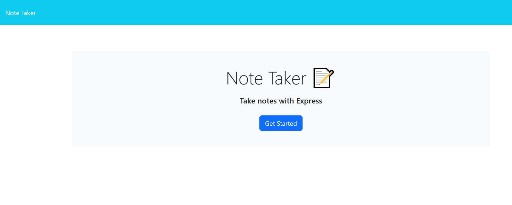
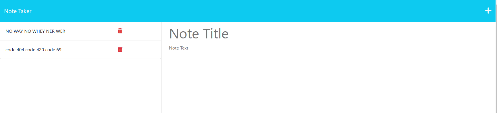
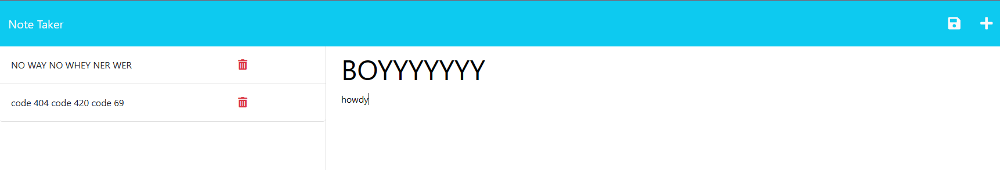
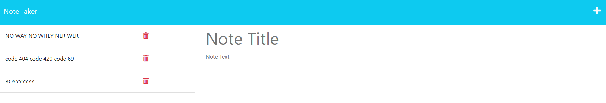
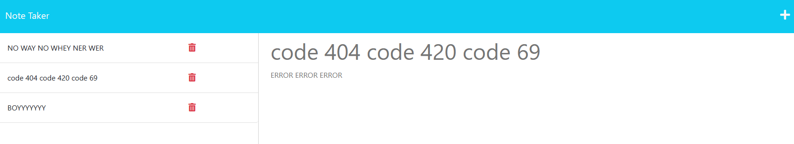

# task-force-404

# task-force-404
  

  This is a simple note task list app that allows you to add (or remove) tasks to a list on a page, and will stay on the list even if the browser is closed.
  ## Table of Contents:
  * [Installation](#installation)
  * [Usage](#usage)
  * [License](#license)
  * [Credits](#credits)
  * [Contributing](#contributing)
  * [Tests](#tests)
  * [Questions](#questions)
  ## Installation:
  If you are just visiting the page, no installation is needed.
  However, if you are running the program from the command line then you must follow the simple instructions below.

  To install the dependencies needed, open the console and run:
  In the command line of integrated terminal - type: npm i 
  ## Usage:

  https://serene-oasis-60773.herokuapp.com/

  GIVEN a note-taking application
  * WHEN I open the Note Taker
  * THEN I am presented with a landing page with a link to a notes page

  

  * WHEN I click on the link to the notes page
  * THEN I am presented with a page with existing notes listed in the left-hand column,   plus empty fields to enter a new note title and the note’s text in the right-hand column
  
  

  * WHEN I enter a new note title and the note’s text
  * THEN a Save icon appears in the navigation at the top of the page

  

  * WHEN I click on the Save icon
  * THEN the new note I have entered is saved and appears in the left-hand column with the other existing notes

  

  * WHEN I click on an existing note in the list in the left-hand column
  * THEN that note appears in the right-hand column

  

  * WHEN I click on the Write icon in the navigation at the top of the page
  * THEN I am presented with empty fields to enter a new note title and the note’s text in the right-hand column

  

  ## License:
  The MIT License (MIT)

      Copyright (c) undefined undefined
      
      Permission is hereby granted, free of charge, to any person obtaining a copy of this software and associated documentation files (the "Software"), to deal in the Software without restriction, including without limitation the rights to use, copy, modify, merge, publish, distribute, sublicense, and/or sell copies of the Software, and to permit persons to whom the Software is furnished to do so, subject to the following conditions:
      
      The above copyright notice and this permission notice shall be included in all copies or substantial portions of the Software.
      
      THE SOFTWARE IS PROVIDED "AS IS", WITHOUT WARRANTY OF ANY KIND, EXPRESS OR IMPLIED, INCLUDING BUT NOT LIMITED TO THE WARRANTIES OF MERCHANTABILITY, FITNESS FOR A PARTICULAR PURPOSE AND NONINFRINGEMENT. IN NO EVENT SHALL THE AUTHORS OR COPYRIGHT HOLDERS BE LIABLE FOR ANY CLAIM, DAMAGES OR OTHER LIABILITY, WHETHER IN AN ACTION OF CONTRACT, TORT OR OTHERWISE, ARISING FROM, OUT OF OR IN CONNECTION WITH THE SOFTWARE OR THE USE OR OTHER DEALINGS IN THE SOFTWARE.
  ## Credits
  I would like to appreciate Ben Sboto, for guiding me down the path of changing the way I was reading/writing files in my app for my notes.js router. 
  ## Contributing:
  N/A
  ## Tests:
  N/A
  ## Questions:
  If you have questions, you may contact me on [GitHub](https://github.com/d-lil) or you may reach out by contacting Daniel Liljegren at dahneel@gmail.com